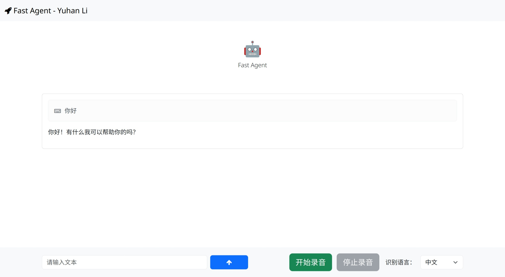
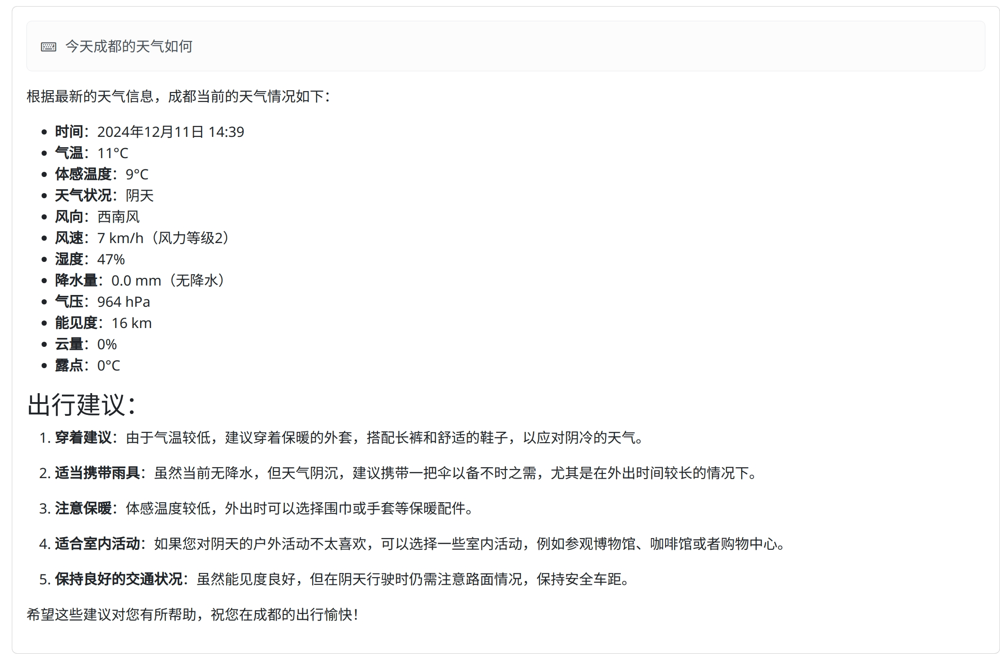
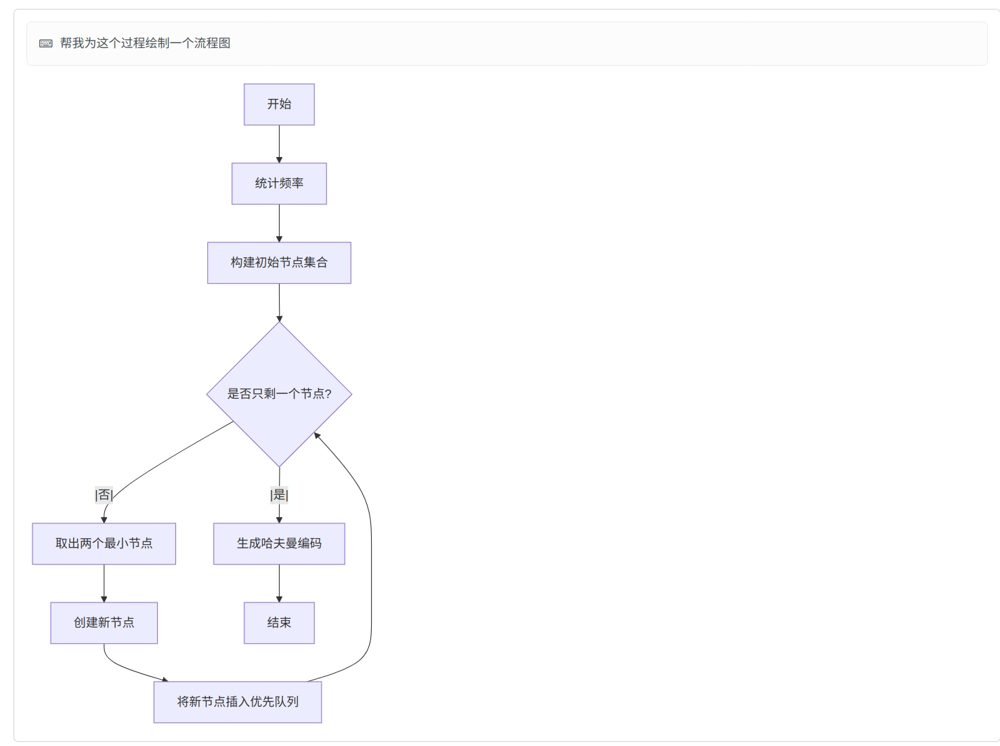

# FastAgent - A Modular Artificial Intelligence Agent

**!! This program is for learning purposes only for the time being and may have low performance issues or security risks !! **

## Intro

This project is a modular AI assistant that aims to make LLM available to users and developers as a general purpose tool. Users can directly use the LLM API to accomplish various tasks, and developers can use the LLM API as middleware to develop extensions for their programs or to develop new programs.

## Currently supported features

-  Text Chatting - This project uses ChatGPT4o-mini by default.

-  Text to Image - Convert natural language to Prompt supported by the text2img model via LLM. text2img model supports customization in this project by default using the Linaqruf/anything-v3.0 pipeline based on Huggingface🤗 diffuser.

  

- Custom Web API Access - This project allows developers to access a custom web API to add more functionality to LLM, which translates natural language into the format required by the developer and processes the content returned by the api. The project comes with a weather API.

  

- Speech Input Support - Speech is converted to text by default using the locally deployed Whisper model, which is also modular and replaceable.

- Mermaid Chart Support - Support for mermaid chart rendering to create charts for user input or LLM output.

  

- Memory capacity - Harmonized memory content management.

- Text to Speech - Accessibility for people with disabilities. The API for this feature has been developed, but is not live.

## Usage

1. Download a VAE Model for Anything-V3.0 (animevae are recommended).
2. Set the environment variable GPT_API_KEY to your GPT API key.
3. Customize config.py to your liking (the default configuration is sufficient for most users).
4. Run app.py to launch API.
5. Open /web-ui/test.html in your browser.
6. Enjoy.

## License

This project is licensed under the GNU AGPLv3 - see the [LICENSE](LICENSE) file for details.

